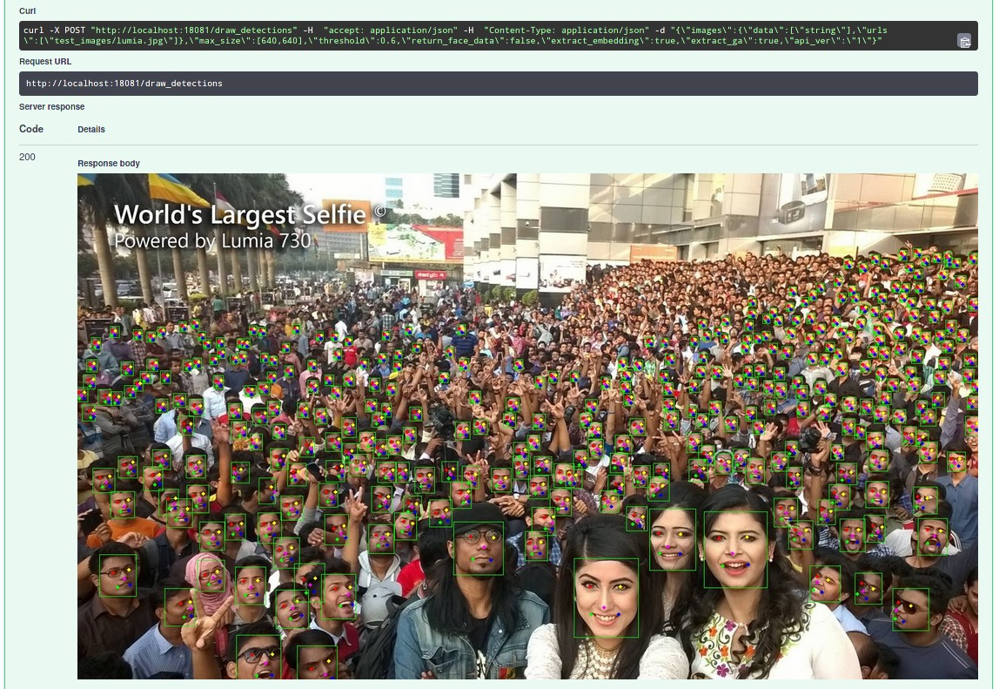

# InsightFace-REST

This repository aims to provide convenient, easy deployable and scalable
REST API for InsightFace face detection and recognition pipeline using
FastAPI for serving and NVIDIA TensorRT for optimized inference.

Code is heavily based on API
[code](https://github.com/deepinsight/insightface/tree/master/python-package)
in official DeepInsight InsightFace
[repository](https://github.com/deepinsight/insightface).

This repository provides source code for building face recognition REST
API and converting models to ONNX and TensorRT using Docker.

## Key features:

- Ready for deployment on NVIDIA GPU enabled systems using Docker and
  nvidia-docker2.
- Automatic model download at startup (using Google Drive).
- Up to 3x performance boost over MXNet inference with help of TensorRT
  optimizations, FP16 inference and batch inference of detected faces
  with ArcFace model.
- Support for older Retinaface detectors and MXNet based ArcFace models, 
  as well as newer `SCRFD` detectors and PyTorch based recognition models (`glintr100`,`w600k_r50`, `w600k_mbf`).
- Up to 2x faster `SCRFD` postprocessing implementation.
- Batch inference supported both for recognition and detection models 
  (currently `SCRFD` family only)
- Inference on CPU with ONNX-Runtime.

## Contents

[List of supported models](#list-of-supported-models)
- [Detection](#detection)
- [Recognition](#recognition)
- [Other](#other)

[Prerequesites](#prerequesites)

[Running with Docker](#running-with-docker)

[API usage](#api-usage)
- [/extract](#extract-endpoint)

[Work in progress](#work-in-progress)

[Known issues](#known-issues)

[Changelog](#changelog)

## List of supported models:

### Detection:

| Model                 | Auto download  | Batch inference | Detection (ms) | Inference (ms) | GPU-Util (%) | Source                      |  ONNX File   |
|-----------------------|:--------------:|:---------------:|:--------------:|:--------------:|:------------:|:----------------------------|:------------:|
| retinaface_r50_v1     |      Yes*      |                 |      12.3      |      8.4       |      26      | [official package][1]       | [link][dl1]  |
| retinaface_mnet025_v1 |      Yes*      |                 |      8.6       |      4.6       |      17      | [official package][1]       | [link][dl2]  |
| retinaface_mnet025_v2 |      Yes*      |                 |      8.8       |      4.9       |      17      | [official package][1]       | [link][dl3]  |
| mnet_cov2             |      Yes*      |                 |      8.7       |      4.6       |      18      | [mnet_cov2][2]              | [link][dl4]  |
| centerface            |      Yes       |                 |      10.6      |      3.5       |      19      | [Star-Clouds/CenterFace][3] | [link][dl5]  |
| scrfd_10g_bnkps       |      Yes*      |       Yes       |      3.3       |       2        |      16      | [SCRFD][4]                  | [link][dl6]  |
| scrfd_2.5g_bnkps      |      Yes*      |       Yes       |      2.2       |      1.1       |      13      | [SCRFD][4]                  | [link][dl7]  |
| scrfd_500m_bnkps      |      Yes*      |       Yes       |      1.9       |      0.8       |      13      | [SCRFD][4]                  | [link][dl15] |
| scrfd_10g_gnkps       |      Yes*      |       Yes       |      3.3       |      2.2       |      17      | [SCRFD][4]**                | [link][dl16] |
| scrfd_2.5g_gnkps      |      Yes*      |       Yes       |      2.3       |      1.2       |      14      | [SCRFD][4]**                | [link][dl17] |
| scrfd_500m_gnkps      |      Yes*      |       Yes       |      2.1       |      1.3       |      14      | [SCRFD][4]**                | [link][dl18] |

> Note: Performance metrics measured on NVIDIA RTX2080 SUPER + Intel Core i7-5820K (3.3Ghz * 6 cores) for 
> `api/src/test_images/lumia.jpg` with `force_fp16=True`, `det_batch_size=1` and `max_size=640,640`.
> 
> Detection time include inference, pre- and postprocessing, but does not include image reading, decoding and resizing.

> Note 2: SCRFD family models requires input image shape dividable by 32, i.e 640x640, 1024x768.

### Recognition:

| Model                  | Auto download | Batch inference | Inference b=1 (ms) | Inference b=64 (ms) | Source                 |  ONNX File   |
|------------------------|:-------------:|:---------------:|:------------------:|:-------------------:|:-----------------------|:------------:|
| arcface_r100_v1        |     Yes*      |       Yes       |        2.6         |        54.8         | [official package][1]  | [link][dl8]  |
| r100-arcface-msfdrop75 |      No       |       Yes       |         -          |          -          | [SubCenter-ArcFace][5] |     None     |
| r50-arcface-msfdrop75  |      No       |       Yes       |         -          |          -          | [SubCenter-ArcFace][5] |     None     |
| glint360k_r100FC_1.0   |      No       |       Yes       |         -          |          -          | [Partial-FC][6]        |     None     |
| glint360k_r100FC_0.1   |      No       |       Yes       |         -          |          -          | [Partial-FC][6]        |     None     |
| glintr100              |     Yes*      |       Yes       |        2.6         |        54.7         | [official package][1]  | [link][dl13] |
| w600k_r50              |     Yes*      |       Yes       |        1.9         |        33.2         | [official package][1]  | [link][dl21] |
| w600k_mbf              |     Yes*      |       Yes       |        0.7         |         9.9         | [official package][1]  | [link][dl22] |

### Other:

| Model            | Auto download | Inference code | Source                      |  ONNX File   |
|------------------|:-------------:|:--------------:|:----------------------------|:------------:|
| genderage_v1     |     Yes*      |      Yes       | [official package][1]       | [link][dl14] |
| mask_detector    |     Yes*      |      Yes       | [Face-Mask-Detection][8]    | [link][dl19] |
| mask_detector112 |     Yes*      |      Yes       | [Face-Mask-Detection][8]*** | [link][dl20] |
| 2d106det         |      No       |       No       | [coordinateReg][9]          |     None     |

`*` - Models will be downloaded from Google Drive, which might be inaccessible in some regions like China.

`**` - custom models retrained for this repo. Original SCRFD models have bug 
([deepinsight/insightface#1518](https://github.com/deepinsight/insightface/issues/1518)) with 
detecting large faces occupying >40% of image. These models are retrained with Group Normalization instead of 
Batch Normalization, which fixes bug, though at cost of some accuracy. 

Models accuracy on WiderFace benchmark:

| Model               |  Easy   |   Medium   | Hard  |
|:--------------------|:-------:|:----------:|:-----:|
| scrfd_10g_gnkps     |  95.51  |   94.12    | 82.14 |
| scrfd_2.5g_gnkps    |  93.57  |   91.70    | 76.08 |
| scrfd_500m_gnkps    |  88.70  |   86.11    | 63.57 |

`***` - custom model retrained for 112x112 input size to remove excessive resize operations and
improve performance.

[1]: https://github.com/deepinsight/insightface/tree/master/python-package
[2]: https://github.com/deepinsight/insightface/tree/master/detection/RetinaFaceAntiCov
[3]: https://github.com/Star-Clouds/CenterFace
[4]: https://github.com/deepinsight/insightface/tree/master/detection/scrfd
[5]: https://github.com/deepinsight/insightface/tree/master/recognition/SubCenter-ArcFace
[6]: https://github.com/deepinsight/insightface/tree/master/recognition/partial_fc
[7]: https://github.com/deepinsight/insightface/tree/master/recognition/arcface_torch
[8]: https://github.com/chandrikadeb7/Face-Mask-Detection
[9]: https://github.com/deepinsight/insightface/tree/master/alignment/coordinateReg

[dl1]: https://drive.google.com/file/d/1peUaq0TtNBhoXUbMqsCyQdL7t5JuhHMH/view?usp=sharing
[dl2]: https://drive.google.com/file/d/12H4TXtGlAr1boEGtUukteolpQ9wfUTWe/view?usp=sharing
[dl3]: https://drive.google.com/file/d/1hzgOejAfCAB8WyfF24UkfiHD2FJbaCPi/view?usp=sharing
[dl4]: https://drive.google.com/file/d/1xPc3n_Y0jKyBONRx71UqCfcHjOGOLc2g/view?usp=sharing
[dl5]: https://drive.google.com/file/d/10tXAXhiq06VNdTAdYt5-pjkGn7zOFMk4/view?usp=sharing
[dl6]: https://drive.google.com/file/d/1OAXx8U8SIsBhmYYGKmD-CLXrYz_YIV-3/view?usp=sharing
[dl7]: https://drive.google.com/file/d/1qnKTHMkuoWsCJ6iJeiFExGy5PSi8JKPL/view?usp=sharing
[dl8]: https://drive.google.com/file/d/1sj170K3rbo5iOdjvjHw-hKWvXgH4dld3/view?usp=sharing
[dl13]: https://drive.google.com/file/d/1TR_ImGvuY7Dt22a9BOAUAlHasFfkrJp-/view?usp=sharing
[dl14]: https://drive.google.com/file/d/1MnkqBzQHLlIaI7gEoa9dd6CeknXMCyZH/view?usp=sharing
[dl15]: https://drive.google.com/file/d/13mY-c6NIShu_-4AdCo3Z3YIYja4HfNaA/view?usp=sharing
[dl16]: https://drive.google.com/file/d/1v9nhtPWMLSedueeL6c3nJEoIFlSNSCvh/view?usp=sharing
[dl17]: https://drive.google.com/file/d/1F__ILEeCTzeR71BAV-vInuyBezYmNMsB/view?usp=sharing
[dl18]: https://drive.google.com/file/d/13OoTQlyDI2BkuA5oJUtuuvMlxvkM_-h7/view?usp=sharing
[dl19]: https://drive.google.com/file/d/1RsQonthhpJDwwdcB0sYsVGMTqPgGdMGV/view?usp=sharing
[dl20]: https://drive.google.com/file/d/1ghS0LEGV70Jdb5un5fVdDO-vmonVIe6Z/view?usp=sharing
[dl21]: https://drive.google.com/file/d/1_3WcTE64Mlt_12PZHNWdhVCRpoPiblwq/view?usp=sharing
[dl22]: https://drive.google.com/file/d/1GtBKfGucgJDRLHvGWR3jOQovHYXY-Lpe/view?usp=sharing

## Requirements:

1. Docker
2. Nvidia-container-toolkit
3. Nvidia GPU drivers (470.x.x and above)

## Running with Docker:

1. Clone repo.
2. Execute `deploy_trt.sh` from repo's root, edit settings if needed.
3. Go to http://localhost:18081 to access documentation and try API

If you have multiple GPU's with enough GPU memory you can try running
multiple containers by editing *n_gpu* and *n_workers* parameters in
`deploy_trt.sh`.

By default container is configured to build TRT engines without FP16
support, to enable it change value of `force_fp16` to `True` in 
`deploy_trt.sh`. Keep in mind, that your GPU should support fast FP16
inference (NVIDIA GPUs of RTX20xx series and above, or server GPUs like 
TESLA P100, T4 etc. ).

Also if you want to test API in non-GPU environment you can run service
with `deploy_cpu.sh` script. In this case ONNXRuntime will be used as
inference backend.

> For pure MXNet based version, without TensorRT support you can check
> depreciated
> [v0.5.0](https://github.com/SthPhoenix/InsightFace-REST/tree/v0.5.0)
> branch

## API usage:

For example of API usage example please refer to
[demo_client.py](https://github.com/SthPhoenix/InsightFace-REST/blob/master/demo_client.py) code.

## Work in progress:

- Add examples of indexing and searching faces (powered by Milvus).
- Add Triton Inference Server as execution backend

## Known issues:

- When `glintr100` recognition model is used `genderage` model returns 
  wrong predictions.

## Changelog:

### 2021-11-06 v0.7.0.0

Since a lot of updates happened since last release version is updated straight to v0.7.0.0

Comparing to previous release (v0.6.2.0)  this release brings improved performance for SCRFD based detectors.

Here is performance comparison on GPU `Nvidia RTX 2080 Super` for `scrfd_10g_gnkps` detector paired with 
`glintr100` recognition model (all tests are using `src/api_trt/test_images/Stallone.jpg`, 1 face per image):

| Num workers | Client threads | FPS v0.6.2.0 | FPS v0.7.0.0 | Speed-up |
|:-----------:|:--------------:|:------------:|:------------:|:--------:|
|      1      |       1        |      56      |     103      |  83.9%   |
|      1      |       30       |      72      |     128      |  77.7%   |
|      6      |       30       |     145      |     179      |  23.4%   |

Additions:
- Added experimental support for msgpack serializer: helps reduce network traffic for embeddings for ~2x.
- Output names no longer required for detection models when building TRT engine - correct output order is now extracted 
  from onnx models.
- Detection models now can be exported to TRT engine with batch size > 1 - inference code doesn't support it yet, though
  now they could be used in Triton Inference Server without issues. 

Model Zoo:
- Added support for WebFace600k based recognition models from InsightFace repo: `w600k_r50` and `w600k_mbf`
- Added md5 check for models to allow automatic re-download if models have changed.
- All `scrfd` based models now supports batch dimension/

Improvements:
- 1.5x-2x faster SCRFD re-implementation with Numba: 4.5 ms. vs 10 ms. for `lumia.jpg` example with
  `scrfd_10g_gnkps` and threshold = 0.3 (432 faces detected)).
- Move image normalization step to GPU with help of CuPy (4x lower data transfer from CPU to GPU, about 6% 
  inference speedup, and some computations offloaded from CPU).
- 4.5x Faster `face_align.norm_crop` implementation with help of Numba and removal of unused computations.
  (Cropping 432 faces from `lumia.jpg` example tooks 45 ms. vs 205 ms.).
- Face crops are now extracted only when needed - when face data or embeddings are requested, improving 
  detection only performance.
- Added Numba njit cache to reduce subsequent starts time.
- Logging timings rounded to ms for better readability.
- Minor refactoring 

Fixes:
- Since gender/age estimation model is currently not supported exclude it from models preparing step.

### 2021-09-09 v0.6.2.0

REST-API
- Use async `httpx` lib for retrieving images by urls instead of urllib3 (which caused 
  performance drop in multi-GPU environment under load due to excessive usage of opened sockets)
- Update draft Triton Infernce Server support to use CUDA shared memory.
- Minor refactoring for future change of project structure.

### 2021-08-07 v0.6.1.0

REST-API
- Dropped support of MXNet inference backend and automatic MXNet->ONNX models conversion, 
  since all models are now distributed as ONNX by default.

### 2021-06-16 v0.6.0.0

REST-API
- Added support for newer InsightFace face detection SCRFD models:
  `scrfd_500m_bnkps`, `scrfd_2.5g_bnkps`, `scrfd_10g_bnkps`
- Released custom trained SCRFD models:
  `scrfd_500m_gnkps`, `scrfd_2.5g_gnkps`, `scrfd_10g_gnkps`
- Added support for newer InsightFace face recognition model `glintr100`  
- Models auto download switched to Google Drive.
- Default models switched to `glintr100` and `scrfd_10g_gnkps`

### 2021-05-08 v0.5.9.9

REST-API
- Added JPEG decoding using PyTurboJPEG -  increased decoding speed for large 
  JPEGs for about 2x.
- Support for batch inference of `genderage` model.
- Support for limiting number of faces for recognition using `limit_faces` parameter 
  in `extract` endpoint.
- New `/multipart/draw_detections` endpoint, supporting image upload using multipart 
  form data.
- Support for printing face sizes and scores on image by `draw_detections` endpoints.
- More verbose timings for `extract` endpoint for debug and logging purposes.

### 2021-03-27 v0.5.9.8

REST-API
- Added v2 output format: more verbose and more suitable for logging.
  Use `'api_ver':'2'` in request body. In future versions this parameter
  will be moved to path, like `/v2/extract`, and will be default output
  format.

REST-API & conversion scripts:
- MXNet version in dockerfiles locked to 1.6.0, since version 1.8.0
  causes missing libopenblas.0 exception.

### 2021-03-01 v0.5.9.7

REST-API & conversion scripts:
- Fixed issue with building TensorRT engine with batch > 1 and FP16
  support, which caused FP32 inference instead of FP16.
- Moved to tensorrt:21.02 base image and removed workarounds for 20.12
  image.
- Changed behaviour of `force_fp16` flag. Now model with FP16 precision
  is build only when set to `True`. Otherwise FP32 will be used even on
  GPUs with fast FP16 support.

### 2021-03-01 v0.5.9.6

REST-API:
- Add flag `embed_only` to `/extract` endpoint. When set to `true`
  input images are processed as face crops, omitting detection phase.
  Expects 112x112 face crops.
- Added flag `draw_landmarks` to `/draw_detections` endpoint.

### 2021-02-13

REST-API:
- Added Dockerfile for CPU-only inference with ONNXRuntime backend.
- Added flag to return landmarks with `/extract` endpoint

### 2020-12-26

REST-API & conversion scripts:
- Added support for `glint360k_r100FC_1.0` and `glint360k_r100FC_0.1`
 face recognition models.

### 2020-12-26

REST-API:
- Base image updated to `TensorRT:20.12-py3`.
- Added temporary fixes for TensortRT 7.2.2 ONNX parsing.
- Added support for `r50-arcface-msfdrop75` face recognition model.

Conversion scripts:
- Same updates as for REST-API

### 2020-12-06

REST-API:
- Added draft support for batch inference of ArcFace model.

Conversion scripts:
- Added draft support for batch inference of ArcFace model.

### 2020-11-20

REST API:
- Pure MXNet version removed from master branch.
- Added models bootstrapping before running workers, to prevent race
  condition for building TRT engine.
- Applied changes from conversion scripts (see below)

Conversion scripts:
- Reshape ONNX models in memory to prevent writing temp files.
- TRT engine builder now takes input name and shape, required for
  building optimization profiles, from ONNX model intself.

### 2020-11-07

Conversion scripts:
- Added support for building TensorRT engine with batch input.
- Added support for RetinaFaceAntiCov model (mnet_cov2, must be manually
  [downloaded](https://github.com/deepinsight/insightface/tree/master/detection/RetinaFaceAntiCov)
  and unpacked to `models/mxnet/mnet_cov2`)

REST API:
- Added support for RetinaFaceAntiCov v2
- Added support for FP16 precision (`force_fp16` flag in
  `deploy_trt.sh`)

### 2020-10-22

Conversion scripts:
- Minor refactoring

REST API:
- Added TensorRT version in `src/api_trt`
- Added Dockerfile (`src/Dockerfile_trt`)
- Added deployment script `deploy_trt.sh`
- Added Centerface detector

TensorRT version contains MXNet and ONNXRuntime compiled for CPU for
testing and conversion purposes.

### 2020-10-16

Conversion scripts:
- Added conversion of MXNet models to ONNX using Python
- Added conversion of ONNX to TensorRT using Python
- Added demo inference scripts for ArcFace and Retinaface using ONNX and
  TensorRT backends

REST API:
- no changes

### 2020-09-28

- REST API code refactored to FastAPI
- Detection/Recognition code is now based on official Insightface Python
  package.
- TensorFlow MTCNN replaced with PyTorch version
- Added RetinaFace detector
- Added InsightFace gender/age detector
- Added support for GPU inference
- Resize function refactored for fixed image proportions (significant
  speed increase and memory usage optimization)

