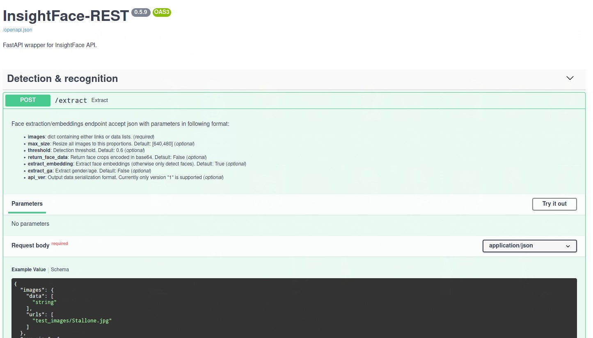

# InsightFace-REST

This repository aims to provide convenient, easy deployable and scalable
REST API for InsightFace face detection and recognition pipeline using
FastAPI for serving and NVIDIA TensorRT for optimized inference.

Code is heavily based on API
[code](https://github.com/deepinsight/insightface/tree/master/python-package)
in official DeepInsight InsightFace
[repository](https://github.com/deepinsight/insightface).

This repository provides source code for building face recognition REST
API and converting models to ONNX and TensorRT using Docker.


## Key features:

- Ready for deployment on NVIDIA GPU enabled systems using Docker and
  nvidia-docker2.
- Fully automatic model bootstrapping, including downloading and
  MXnet->ONNX->TensorRT conversion of official DeepInsight InsightFace
  models.
- Up to 3x performance boost over MXNet inference with help of TensorRT
  optimizations, FP16 inference and batch inference of detected faces
  with ArcFace model.

## Contents

[List of supported models](#list-of-supported-models)
- [Detection](#detection)
- [Recognition](#recognition)
- [Other](#other)

[Prerequesites](#prerequesites)

[Running with Docker](#running-with-docker)

[API usage](#api-usage)
- [/extract](#extract-endpoint)

[Work in progress](#work-in-progress)

[Known issues](#known-issues)

[Changelog](#changelog)


## List of supported models:

### Detection:

| Model                 | Auto download | Inference code | Source                                                                                          |
|:----------------------|:--------------|:---------------|:------------------------------------------------------------------------------------------------|
| retinaface_r50_v1     | Yes           | Yes            | [official package](https://github.com/deepinsight/insightface/tree/master/python-package)       |
| retinaface_mnet025_v1 | Yes           | Yes            | [official package](https://github.com/deepinsight/insightface/tree/master/python-package)       |
| retinaface_mnet025_v2 | Yes           | Yes            | [official package](https://github.com/deepinsight/insightface/tree/master/python-package)       |
| mnet_cov2             | No            | Yes            | [mnet_cov2](https://github.com/deepinsight/insightface/tree/master/detection/RetinaFaceAntiCov) |
| centerface            | Yes           | Yes            | [Star-Clouds/CenterFace](https://github.com/Star-Clouds/CenterFace)                             |

### Recognition:

| Model                  | Auto download | Inference code | Source                                                                                                    |
|:-----------------------|:--------------|:---------------|:----------------------------------------------------------------------------------------------------------|
| arcface_r100_v1        | Yes           | Yes            | [official package](https://github.com/deepinsight/insightface/tree/master/python-package)                 |
| r100-arcface-msfdrop75 | No            | Yes            | [SubCenter-ArcFace](https://github.com/deepinsight/insightface/tree/master/recognition/SubCenter-ArcFace) |
| r50-arcface-msfdrop75  | No            | Yes            | [SubCenter-ArcFace](https://github.com/deepinsight/insightface/tree/master/recognition/SubCenter-ArcFace) |
| glint360k_r100FC_1.0   | No            | Yes            | [Partial-FC](https://github.com/deepinsight/insightface/tree/master/recognition/partial_fc)               |
| glint360k_r100FC_0.1   | No            | Yes            | [Partial-FC](https://github.com/deepinsight/insightface/tree/master/recognition/partial_fc)               |

### Other:

| Model        | Auto download | Inference code | Source                                                                                          |
|:-------------|:--------------|:---------------|:------------------------------------------------------------------------------------------------|
| genderage_v1 | Yes           | Yes            | [official package](https://github.com/deepinsight/insightface/tree/master/python-package)       |
| 2d106det     | No            | No             | [coordinateReg](https://github.com/deepinsight/insightface/tree/master/alignment/coordinateReg) |

## Prerequesites:

1. Docker
2. Nvidia-container-toolkit
3. Nvidia GPU drivers (455.x.x and above)


## Running with Docker:

1. Clone repo.
2. Execute `deploy_trt.sh` from repo's root.
3. Go to http://localhost:18081 to access documentation and try API

If you have multiple GPU's with enough GPU memory you can try running
multiple containers by editing *n_gpu* and *n_workers* parameters in
`deploy_trt.sh`.

> For pure MXNet based version, without TensorRT support you can check
> depreciated
> [v0.5.0](https://github.com/SthPhoenix/InsightFace-REST/tree/v0.5.0)
> branch


## API usage:

> _This documentation might be outdated, please referer  
> to builtin API documentation for latest version_
> 

### `/extract` endpoint


Extract endpoint accepts list of images and return faces bounding boxes
with corresponding embeddings.

API accept JSON in following format:

```
{
  "images":{
      "data":[
          base64_encoded_image1,  
          base64_encoded_image2
      ]
  },
  "max_size":[640,480]
}
```

Where `max_size` is maximum image dimension, images with dimensions
greater than `max_size` will be downsized to provided value.

If `max_size` is set to **0**, image won't be resized.

To call API from Python you can use following sample code:

```python
import os
import json
import base64
import requests

def file2base64(path):
    with open(path, mode='rb') as fl:
        encoded = base64.b64encode(fl.read()).decode('ascii')
        return encoded


def extract_vecs(ims,max_size=[640,480]):
    target = [file2base64(im) for im in ims]
    req = {"images": {"data": target},"max_size":max_size}
    resp = requests.post('http://localhost:18081/extract', json=req)
    data = resp.json()
    return data
    
images_path = 'src/api/test_images'
images = os.path.listdir(images_path)
data = extract_vecs(images)

```

Response is in following format:

```json
[
    [
        {"vec": [0.322431242,0.53545632,], "det": 0, "prob": 0.999, "bbox": [100,100,200,200]},
        {"vec": [0.235334567,-0.2342546,], "det": 1, "prob": 0.998, "bbox": [200,200,300,300]},
    ],
    [
        {"vec": [0.322431242,0.53545632,], "det": 0, "prob": 0.999, "bbox": [100,100,200,200]},
        {"vec": [0.235334567,-0.2342546,], "det": 1, "prob": 0.998, "bbox": [200,200,300,300]},
    ]
]
```

First level is list in order the images were sent, second level are
faces detected per each image as dictionary containing face embedding,
bounding box, detection probability and detection number.


## Work in progress:

- Add Triton Inference Server as execution backend
- Add Cython postprocessing of Retinaface predictions.


## Known issues:

- Building TensorRT engine with batch inference is currently not
  supported for TensorRT Docker images above 20.09 tag, due to bug in
  BatchNorm layers parsing in TRT version >= 7.2.

## Changelog:

### 2020-12-26

REST-API & conversion scripts:
- Added support for `glint360k_r100FC_1.0` and `glint360k_r100FC_0.1`
 face recognition models.

### 2020-12-26

REST-API:
- Base image updated to `TensorRT:20.12-py3`.
- Added temporary fixes for TensortRT 7.2.2 ONNX parsing.
- Added support for `r50-arcface-msfdrop75` face recognition model.

Conversion scripts:
- Same updates as for REST-API

### 2020-12-06

REST-API:
- Added draft support for batch inference of ArcFace model.

Conversion scripts:
- Added draft support for batch inference of ArcFace model.


### 2020-11-20

REST API:
- Pure MXNet version removed from master branch.
- Added models bootstrapping before running workers, to prevent race
  condition for building TRT engine.
- Applied changes from conversion scripts (see below)

Conversion scripts:
- Reshape ONNX models in memory to prevent writing temp files.
- TRT engine builder now takes input name and shape, required for
  building optimization profiles, from ONNX model intself.

### 2020-11-07

Conversion scripts:
- Added support for building TensorRT engine with batch input.
- Added support for RetinaFaceAntiCov model (mnet_cov2, must be manually
  [downloaded](https://github.com/deepinsight/insightface/tree/master/detection/RetinaFaceAntiCov)
  and unpacked to `models/mxnet/mnet_cov2`)

REST API:
- Added support for RetinaFaceAntiCov v2
- Added support for FP16 precision (`force_fp16` flag in
  `deploy_trt.sh`)

### 2020-10-22

Conversion scripts:
- Minor refactoring

REST API:
- Added TensorRT version in `src/api_trt`
- Added Dockerfile (`src/Dockerfile_trt`)
- Added deployment script `deploy_trt.sh`
- Added Centerface detector

TensorRT version contains MXNet and ONNXRuntime compiled for CPU for
testing and conversion purposes.

### 2020-10-16

Conversion scripts:
- Added conversion of MXNet models to ONNX using Python
- Added conversion of ONNX to TensorRT using Python
- Added demo inference scripts for ArcFace and Retinaface using ONNX and
  TensorRT backends

REST API:
- no changes

### 2020-09-28

- REST API code refactored to FastAPI
- Detection/Recognition code is now based on official Insightface Python
  package.
- TensorFlow MTCNN replaced with PyTorch version
- Added RetinaFace detector
- Added InsightFace gender/age detector
- Added support for GPU inference
- Resize function refactored for fixed image proportions (significant
  speed increase and memory usage optimization)


