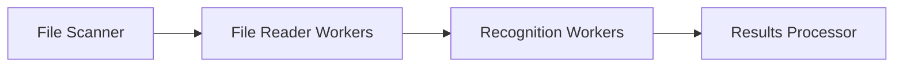

# Examples Directory

This directory contains practical examples demonstrating how to use the InsightFace-REST client library in various scenarios. Each example focuses on solving specific real-world problems using the face recognition API.

## Examples

### 1. Asynchronous Directory Processing

**File:** [`process_dir_async.py`](process_dir_async.py)

This example demonstrates how to efficiently process large image collections using asynchronous I/O and parallel API requests. It implements a production-ready pipeline for batch processing thousands of images through a face recognition API.

#### Key Features:
- Recursive directory scanning
- Parallel image reading
- Batch API processing
- Progress tracking
- Error handling

#### Requirements:
```bash
pip install aiofiles tqdm
```

#### Usage:
```bash
python3 examples/process_dir_async.py
```

#### Configuration:
Modify these variables at the bottom of the file:
```python
host = 'http://localhost'  # Recognition API host
port = 18081               # Recognition API port
images_dir = 'misc/test_images'  # Directory with images to process
```

#### Pipeline Architecture:



## Running Examples

All examples are designed to be run from the root of the project repository:

```bash
python3 examples/<filename>.py
```

## Adding New Examples

To contribute a new example:
1. Create a new Python file in this directory
2. Include comprehensive docstrings and comments
3. Add a section to this README describing:
   - The problem it solves
   - Key features
   - Usage instructions
   - Any special requirements
5. Submit a pull request

## Troubleshooting

If you encounter issues running the examples:
1. Verify the InsightFace-REST server is running
2. Check host and port configuration matches your server
3. Ensure all dependencies are installed
4. Confirm the image directory path is correct
5. Check file permissions for the image directory

For additional support, please open an issue in the project repository.